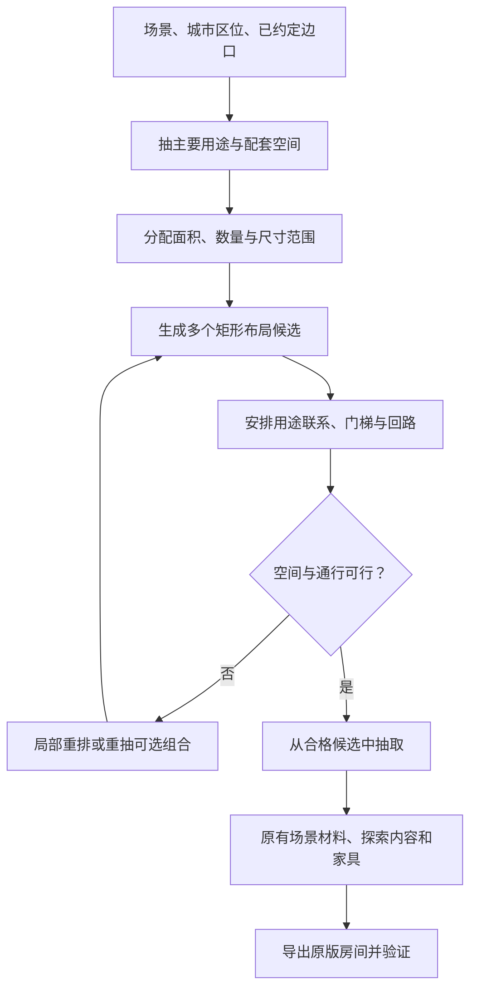

# 按场景规则随机生成分区：实施规划

2026-09-23。原规划基于 v11.1 源码与提交 `ee89065`，保存于 `fe73135`。随后用户要求“请开始实施。我想先在html里看效果”，现已完成下述几何原型与 HTML 对照。正文保留原规划；完整游戏接入、家具需求落实、真实通行和部署尚未完成。

当前入口：[v12.3 厚墙与合并预览](partition-preview-v12-3/index.html)、[验证与局限](partition-preview-v12-3/validation.md)。首次 [v12 分区预览](partition-preview-v12/index.html) 已实现用途需求先行、受约束矩形切分、部分错开分隔、局部重排、用途联系加权和阶段独立种子；其 512 组新布局通过静态检查，8 组新旧对照已用原版渲染。原型仅由明确的 `context.partition="rules"`、固定种子和边口启用，正式 F1 仍使用 v11.1。未将“本批成功”当成全种子、任意入口或正式发布证明。

后续反馈已实现为 [v12.2 尺度与楼层预览](partition-preview-v12-2/index.html)：按对应原版压低普通房、部分采用共层布局、扩大大小反差并随机空间数量。原版 120 间普通池几何调查和 12 间逐房核对见 [依据](partition-preview-v12-2/native-study.md)；本次 512 组、8 对前后实景及 4 间原房的 [验证](partition-preview-v12-2/validation.md) 独立保留。正文的“当前”指最初规划时点，正式 F1 接入与部署仍待后续。

## 1. 目标与已确认决定

2026-09-23 最新接续：[v12.3 厚墙与合并预览](partition-preview-v12-3/index.html)。用户后续明确要求厚实体块、减少房数，以及通过矩形规划后拆墙得到不规则房；并确认“横向为主，少量跨层合并”。因此下文最初 Q1 的“矩形房、不合并”限制已被本次决定替代，矩形仅继续作为规划与家具子区。实际新增实体需求、局部横向/跨层合并，512 组静态通过；原版依据和局限见 [本轮记录](partition-preview-v12-3/validation.md)。仍先 HTML、不部署。

让同一场景、甚至同一用途的合成房，都能有明显不同的内部房间数量、尺寸、位置和连接关系；同时保留对应原版场景的建筑特点。

本轮用户已确认：

- **Q1：这轮保持矩形，先丰富数量、尺寸和位置。** 每个内部规划空间仍是单个矩形；不引入 L 形房、多边形房或空间合并系统。既有矩形大厅中的局部平台、斜梯可以继续使用。
- **Q2：允许明显用途侧重，保留合理配套。** 一间工厂合成房可以主要是仓储，另一间主要是生产或维修，不必每间都包含所有用途。

沿用此前决定：从零生成；四场景区分；普通功能房保持紧凑；一次探索固定场景；城市建筑、街巷、屋顶在地图层延续；向右、向下无限扩张；任一实际开放边口均可进入和返回；无固定首入口、统一游览顺序或每房必有的中央井。总体鼓励回环，也允许简单通路与有内容的尽头。下水道必经路线保持干燥。

本轮“分区”指一间 48×25 格合成房内部的空间划分。地图层已经确定的场景、城市区位和相邻边口作为规划条件输入。

## 2. 当前随机性卡在哪里

以下是源码事实，和后文的拟实施规则分开：

| 当前做法 | 对变化的限制 | 证据 |
|---|---|---|
| `seedScene` 先抽一个 `sceneForm`，再执行该构造的坐标规则 | 房型内部的主要空间位置、切分顺序仍有明显惯性 | [RRArchitecture.as](../src/rr/RRArchitecture.as) 的 `build / seedScene` |
| `refineSpaces` 优先切最超标的空间，在最接近中心的四个合法切口中抽选 | 更容易反复出现近似的尺度比例与分隔位置 | 同文件 `refineSpaces` |
| `connectVolumes` 打乱全部邻接边，先连成树，再随机补边 | 保证连通，但没有表达控制室、作业区、服务廊之间的用途关系 | 同文件 `adjacent / connectVolumes` |
| 家具和内容在地形完成后找位置 | 有些几何合法的小房最后放不下能说明用途的设施 | [RRFurnish.as](../src/rr/RRFurnish.as)、[RRPopulation.as](../src/rr/RRPopulation.as) |
| 各房共用推进中的随机序列 | 同一总种子还依赖调用顺序；调整前一房会改变后一房，不利于对照 | [RRSynth.as](../src/rr/RRSynth.as)、[RRGrowth.as](../src/rr/RRGrowth.as) |

当前 `profile.min/max/bias` 和旧 `partition` 不是有效布局入口，不能把调这些值当成实现本规划。

## 3. 推荐路线与取舍

| 路线 | 玩家能得到什么 | 代价与局限 | 本轮判断 |
|---|---|---|---|
| 扩大现有构造的坐标浮动范围 | 熟悉构造的宽窄、偏置有更多变化 | 主体排列和切分习惯仍然固定 | 可作低成本对照，不作为主体 |
| 先随机切块，再给块分配用途 | 很快增加矩形大小和数量变化 | 用途迁就几何，四场景容易成为同一种切块图换家具 | 可复用其中的几何操作，不单独采用 |
| **先生成用途组合与关系，再随机安排矩形分区，同时检查连接可实现性** | 同场景可以出现不同的功能组合；同一组合也能换位置、比例和走法 | 要处理布局失败、设施净空和关系冲突，工程改动中等 | **推荐作为主体** |

这里的“先生成用途”是先提出可调整的空间需求，不是先画一张必须原样实现的任意连接图。矩形、边口和楼梯限制会反过来约束用途组合，安排不下时允许调整可选配套或重新抽样。

## 4. 新流程

### 4.1 抽“这里主要做什么”，再抽配套

抽选一个主要用途倾向，再按条件生成次要用途、数量范围和面积预算。主要用途可以由一个大空间承担，也可以由几个中小空间共同承担；不能自动等同于“固定一个中央大厅”。

例如仓储为主时，可以有一个高仓库和少量管理附室，也可以是多个低仓间与装卸通道。控制室、检修间等按需要出现；不把“仓库＋控制室＋办公室”写成永远齐全的清单。

每个用途声明：最小可用宽高、可变面积范围、必要落脚/设施空间、偏好的邻居，以及是否可省略。空间总预算同时计入墙体、交通、设备基础和水体；不要先分满房间，再挤出楼梯。

### 4.2 生成矩形分布

采用**受用途约束的随机切分，加局部矩形重排**，以现有矩形数据结构为交付边界：

1. 根据用途组合，把空间需求随机分组。分组兼顾用途联系，不固定先左右再上下，也不固定每组代表一整层。
2. 对当前局部区域枚举合法的横切、竖切与切口范围；两边必须容纳各自的最小需求、墙厚和门梯余量。
3. 从可行区间按场景规则抽切口，允许偏置比例，不只挑中线附近。下一刀只作用于选中的局部区域，各区域层高独立。
4. 在部分相邻矩形组成的矩形范围内，重抽内部切分、移动隔墙或改变 T 形交点朝向；每个最终房间仍保持矩形。局部操作保留该组用途总需求，并重新检查边口和尺寸。
5. 有界地保留多个满足约束的候选。通过质量底线后再随机选取，不总拿同一评分公式的最高分，以免又收敛成一个“标准答案”。

第 4 步是防止递归切分留下固定贯穿分隔线的重要措施。原型要确认它能提供真实的布局变化；若可操作区域太少，应改进局部重排能力，不能用增加房型名字掩盖问题。

房间数由用途、尺度和可用面积共同决定。普通功能房沿用 v11.1 的紧凑方向；有用途的大作业厅、蓄水池和公共厅允许占较多空间。不是每个用途都增加相同数量的小房。

### 4.3 在布局过程中安排联系

用途联系分三级：

- **必须实现的联系**：某个候选方案明确需要的干岸—检修道、上下通道—接收平台等。并非所有房都强制出现这些空间。
- **偏好的联系**：控制室靠近作业区，仓储靠近装卸空间；可直接相邻，也可通过短公共交通空间相连。必要时重排布局，不偷偷把“靠近”解释成隔着整间房也算。
- **不宜出现的联系**：必经路线穿过水池、普通小卧室被迫承担所有边口之间的交通等；前者是硬约束，后者通常是低权重选择。

连通骨架仍须覆盖全部承诺可探索的空间，但边的选取要结合用途和实际门梯位置，额外连接按场景与本间组合变化。不要先强制一条完整主路再把房间挂上去，也不要求每间形成同一种回环。

所有连接按可双向行走的空间关系处理，没有“起点门”和“终点门”。实际边口、转弯和楼梯附近继续用原版门、灯和空间开敞程度帮助辨认。

## 5. 四场景的规则内容

参考既有 [原版场景调查](native-scene-audit-2026-09-20.md) 与对应原版实景。下表是生成规则方向，不是四套固定坐标模板。

| 场景 | 可以抽取的用途侧重 | 分区与联系规则 | 比较时重点看 |
|---|---|---|---|
| 工厂 | 生产、仓储、维修及控制配套 | 大小空间有层级；作业/仓储可偏置或分成数间；控制附室靠近工作区；装卸层、设备基础和交通有各自的面积 | 能否同时出现高仓库、紧凑车间群、维修翼，而非每间一大厅两侧室 |
| 废弃避难厩 | 居住、办公、公共活动、技术服务 | 小功能单元围绕局部公共交通组织；生活与技术区的墙门和设施不同；公共厅为可选空间；各片区层高可以错开 | 单元数量、走廊长度与位置变化，仍像有人使用过的内部建筑 |
| 下水道 | 干管网、泵管检修、沟渠、蓄水设施 | 干房允许无池；水区面积/深度和干岸一起安排；检修间靠近管网；水体不是事后在任意小房底部挖一个洞 | 干管道、浅渠和深池能有不同分布，全部必经连接保留干路 |
| 城市废墟 | 地图规定的住宅、办公、商业、坍塌、屋顶或街隙内部变化 | 先遵守所在建筑/街道/屋顶身份；楼内房间数量和比例再随机；同建筑用途延续，外立面、窗带和交通仍合理 | 不破坏街巷位置和楼体连续性，同用途楼层内部仍不重复 |

城市的“用途侧重”受地图级建筑身份约束，不能为随机性把一格街巷改成住宅楼。下水道设备名称也不能成为引入工厂专属敌群或设施的借口。

## 6. 可调规则与不可放松的条件

以下都是拟新增或重组的有效规则，尚未接入正式生成器；不直接映射为一组给玩家的设置滑杆。

| 规则组 | 调整什么 | 预期作用 |
|---|---|---|
| 用途组合权重 | 主要用途、配套出现机会、重复功能单元数量 | 控制这一片区域“主要做什么” |
| 尺度与面积配额 | 各用途宽高范围、面积比例、大小空间混合 | 改变疏密和房间数量，避免所有小房一样大 |
| 相邻偏好 | 哪些用途应相邻、应通过公共交通联系 | 保留建筑使用逻辑 |
| 分布偏好 | 横纵切分、偏置程度、局部层高对齐、重排机会 | 改变房间位置与轮廓，减少整幅平行楼板 |
| 交通预算 | 交通空间占比、可选连边、门/开口/楼梯的适用关系 | 改变支路、回环与穿行方式 |
| 实体与特殊空间预算 | 厚结构、设备底座、挑空、水体 | 各场景保留不同的实与空 |
| 搜索预算 | 候选数、局部重排次数、失败重试上限 | 控制生成耗时，便于定位被淘汰的组合 |

硬约束包括：边口和镜像匹配、旧房不改、矩形不重叠、有效支撑与净空、门梯可用、所有声明可探索空间可往返、下水道必经干路、场景材料与生态边界。

用途配比、偏置、层高对齐和回环倾向大多是软规则。规则太硬会重新形成模板，太软则会丢失建筑逻辑；这部分用原型对照调权重，不凭字段名字假定效果。

## 7. 代码改造边界

| 位置 | 拟改动 | 保留的职责 |
|---|---|---|
| 新增用途规则模块（暂名 `RRSpaceRules`） | 按场景和城市上下文生成用途需求、尺度和关系 | 不接管敌人生成或素材库 |
| 新增矩形规划模块（暂名 `RRPartitionPlan`） | 切分、局部重排、候选筛选，输出矩形列表和连接约束 | 不直接写原版 XML |
| `RRArchitecture` | 用新规划阶段替换 `seedScene/refineSpaces`；`connectVolumes` 接受用途和可实现性要求 | 地形、门梯、平台、水体、材料、通行审查仍由既有层实现，必要时修正适配 |
| `RRFurnish / RRPopulation` | 提供或共享最小摆放需求；规划预留核心设施位置；检查实际摆放是否符合用途 | 沿用原版物体、生态和正常交互，不借本轮扩大敌人池 |
| `RRSynth` | 接收新规划、阶段独立随机序列；导出用途/规则版本/拒绝原因等诊断信息 | 原版房间导出、完整验证链 |
| `RRGrowth / RRSeed` | 传入可复现的地图身份、坐标、阶段种子；镜像和房内抽样不互相扰动 | 右/下扩张、原对象状态及旧 XML 保持 |
| `RRMapPlan / RRPorts` | 复用现有边口和城市区位结果作为硬输入 | 原有地图连通和城市编排规则 |

矩形输出继续使用实际的 `x0/x1/top/floor/role`，保持家具、水体、空间归属与测试目标的含义明确。`sceneForm` 可保留为兼容的用途家族标签；需要检查它在环境、家具和展示中的消费者，不能只改标签导致错误设施出现。

规划期预留核心设施的落脚面和操作净空，随后仍由原有内容层实际创建。只检查“房间总面积够大”不够；楼梯占位后仍要能放下该用途的最小组合。非必要装饰的摆放失败不触发整房重做。

随机序列拆分以复现为目的：地图边口、用途、几何候选、连接、探索物、家具分别派生；每次尝试也有独立编号。诊断记录保存版本、地图/房间身份和全部规划条件。新版本同种子不承诺复刻 v11.1 的旧房；已生成房继续保持，评估与使用从新探索地图开始。

## 8. 失败处理与工程风险

采用有限搜索：先局部重排，再调整可选配套/数量，最后换一个合法用途组合；硬约束始终保留。每种退让都记录，尤其不能让难生成的用途在接受样本里悄悄消失。

当前整房最多尝试 48 次。原型先保留这个外层上限，对内部候选/回溯设置总操作预算，测量实际耗时后再定值，避免叠成多重无界搜索。用确定的操作次数限制候选，耗时作为观测数据，避免机器快慢改变同种子的结果。

预算耗尽时延续明确的失败报告，不悄悄套回同一旧构造并记作新算法成功。原型保留 v11.1 作为独立对照；部署前若需要运行时降级策略，应给出确实通过同组边口检查的方案和单独的降级统计。

| 风险/未验证假设 | 可能的后果 | 原型要解决的证据 |
|---|---|---|
| 用途组合能否装入 46×23 的内部空间并满足边口 | 重试过多，某些侧重长期出不来 | 按用途与边口统计尝试、接受、调整和失败 |
| 随机切分和局部重排能否打破贯穿分隔线 | 图像不同但还是相似的两三段布局 | 主要隔墙/楼板位置、长直线占比、主要空间偏置分布 |
| 关系偏好是否过强或过弱 | 重新模板化，或像随意隔出的杂物间 | 同用途/同边口的分布与连接对照，参考对应原版 |
| 门梯和设施争用有限地面 | 小房空荡、关键物体放不下或堵路 | 规划最小设施可放率、实际成组摆放率、带家具的真实通行 |
| 多候选搜索是否过慢 | F1 或扩张卡顿 | 批量及原版运行中的中位数、较慢样本和最坏耗时 |

可逆性：本轮数据仍为矩形，未引入复杂形状协议；开发候选与正式 v11.1 分离。完整接入后需成组回退规划、连接和种子调用，不能只切回某一个布局函数。主要影响新探索地图的空间安排与生成耗时。

## 9. 实施顺序与每步产物

1. **固定对照条件。** 保存 v11.1 输入边口、场景/城市区位、版本、样本及指标；明确房间/走廊/平台的计数口径。来自旧随机序列的样本可冻结，不能只写“同种子”便当成输入一致。
2. **四场景几何原型。** 实现用途需求、矩形候选和用途联系；输出真实 AS3 结果的分区、门梯、预留位置图。用最小设施尺寸检查约束，但暂不靠装饰图掩盖空间问题。
3. **结构对照与调整。** 同一主要用途、同一组边口下连续看多张图；四场景分别比较位置、尺寸、数量和连接分布。原型失败与偏向一起统计，再调规则。
4. **接回现有场景与内容。** 恢复对应材料、背景、家具、敌群、奖励与机关，原版实际渲染，对照同用途原版房。关键设施若经常放不下，回到空间规划修正。
5. **完整运行验证。** 多方向进入和返回、内部空间访问、四类向右/向下扩张、旧房及内容保持、下水道干路；检查生成耗时和失败分布。
6. **形成可审查候选。** 提供新旧对照、对应原版实景、指标、失败边界与可复现输入。部署沿用工作区发布流程；本规划本身不等于部署。

第一阶段建议样本设计：四场景各选 4 组合法边口条件，每组固定主要用途生成 8 间，共 128 间，用来隔离“同条件下的分布变化”；另用固定列表覆盖全部用途规则和城市区位。这是原型覆盖起点，不是充分性证明，也不承诺一个样本量可以穷尽随机性。

## 10. 如何判断改进是否成立

### 必须成立的运行条件

复用批量 AS3 导出、`verify_architecture.py / verify_scenes.py / verify_population.py / verify_city_map.py`、`RRTraversal` 以及原版运行驾驶器。新用途标签可能需要更新测试数据定义，但不得因此放宽边口、材料、生态和通行要求。

既有地形图检查发生在探索物和家具创建之前；因此必须补充带实际物体的检查与实机行走。静态可达不能代替原版按键、门交互、坡梯和家具碰撞验证。

### 必须比较的变化

- **数量与比例**：每种用途/边口条件下的房间数、面积组合、最大空间占比；普通功能房不靠变大获得所谓多样性。
- **位置与层次**：大空间在左/中/右、上/中/下的分布；楼板高度和长度；是否仍有少数固定贯穿分隔线。
- **联系与走法**：用途相邻关系、分支和回环、连接瓶颈、各开放边口之间的路径关系。镜像和仅拉伸尺寸不能单独当成新的走法。
- **用途可见性**：核心设施能放下并能接近，实际布局符合房间用途。保留空墙的比例和最大空矩形也要看，不能只统计分区数增加。
- **生成过程偏差**：抽选比例与最终接受比例并列；记录难以安排的组合、被省略的配套、重试与预算耗尽。

可复用 `measure_v8_diversity.py` 和 `compare_room_density.py`，但旧图指纹数量只是一种下界统计，哈希不同不等于自然。新增用途与边口关联指标，并把平台、交通空间、真正功能房分开报告。

### 风格验收

分别对照工厂作业/仓储、避难厩生活/技术、下水道管网/池岸、城市楼内/街隙的原版实例。看建筑用途是否可辨、交通是否可信、家具是否成组、材料与生态是否对应。原版某项素材出现频率不直接等同新生成概率。

展示预先确定的样本、典型失败和极端尺寸样本，不只挑好看的成功房。统计可以揭露重复、空荡和偏差，不能替用户作出“已经像原版”的审美判断。

## 11. 当前停点

Q1、Q2 已收敛，无需再询问矩形范围、用途侧重或此前已确定的地图规则。推荐路线与以上实施细节属于本轮规划，尚无原型效果或性能证据。

下一步是在确认这份规划后，实施第 1–3 步的几何原型并展示真实生成结果；先用空间分布证据判断方向，再接入完整候选。正式运行仍为 v11.1。
